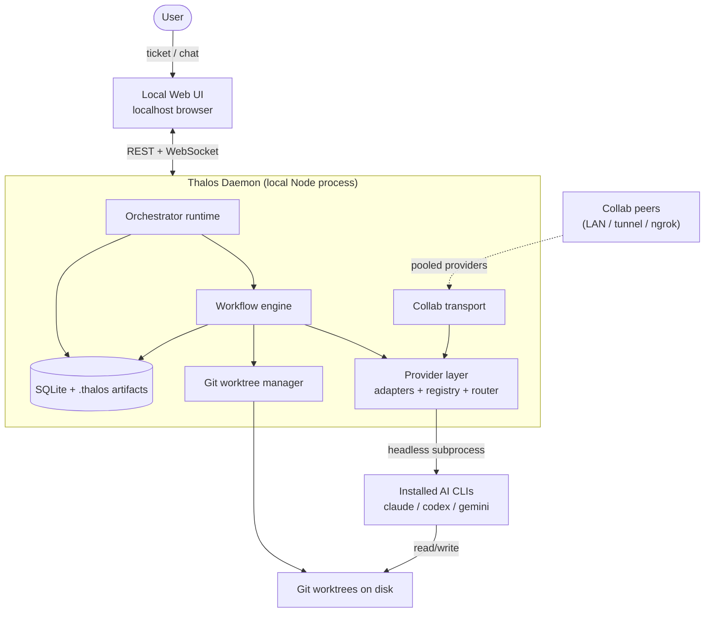
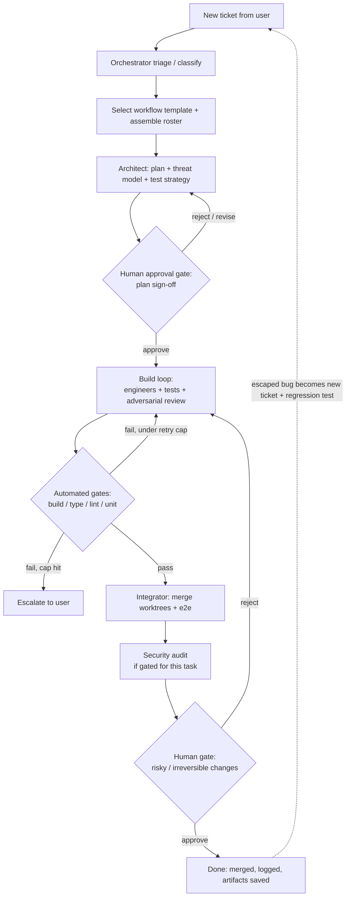

# Thalos Lab — Source of Truth

> A local-only orchestration app that turns the AI coding CLIs already installed on your machine (Claude Code, Codex, Gemini CLI, …) into a coordinated, role-based engineering team that builds and maintains software products end to end.

This document is the authoritative spec for building Thalos Lab. It is written to be handed directly to Claude Code. It commits to specific technical decisions, each with rationale. All previously open forks are now **resolved** in [`docs/DECISIONS.md`](DECISIONS.md), which is authoritative wherever it refines a default below; the relevant passages here have been updated to match (see [§16 Decisions](#16-decisions)).

---

## Table of contents

1. [Overview and vision](#1-overview-and-vision)
2. [Core principles](#2-core-principles)
3. [System architecture](#3-system-architecture)
4. [Technology stack](#4-technology-stack)
5. [Provider abstraction layer](#5-provider-abstraction-layer)
6. [The agent system](#6-the-agent-system)
7. [The workflow engine](#7-the-workflow-engine)
8. [Orchestrator interaction model](#8-orchestrator-interaction-model)
9. [Git and execution model](#9-git-and-execution-model)
10. [Data model](#10-data-model)
11. [Collab mode](#11-collab-mode)
12. [UI / UX specification](#12-ui--ux-specification)
13. [CLI / launcher specification](#13-cli--launcher-specification)
14. [Security and safety](#14-security-and-safety)
15. [Implementation roadmap](#15-implementation-roadmap)
16. [Decisions](#16-decisions)
17. [Appendix: repo structure and API surface](#17-appendix-repo-structure-and-api-surface)

---

## 1. Overview and vision

### What it is

Thalos Lab is a **local-first desktop application** for building and maintaining software products with a team of AI agents. It does not ship its own model and does not call any hosted API directly. Instead it **detects and drives the agentic CLIs the user already has installed and authenticated** — `claude` (Claude Code), `codex` (OpenAI Codex CLI), `gemini` (Gemini CLI), and any future equivalents — and uses each one as an interchangeable LLM backend for a specific *role* in an engineering workflow.

The user launches it from a terminal (`thaloslab`), which starts a local daemon and opens a web UI in the browser. Everything runs on the user's machine; code lives in real git repositories on disk.

### The core thesis

Three ideas, all carried over directly from the architecture work that preceded this spec:

1. **An orchestrator of orchestrators.** The agentic CLIs are themselves capable of editing files and running commands. Thalos Lab does not re-implement that. It sits one level up: it decomposes work, assigns each scoped unit to the right CLI running in an isolated git worktree, gates the result, and integrates. The CLIs are the hands; Thalos is the project lead.

2. **Per-task rosters, not a fixed pipeline.** A bug fix, a security audit, and a from-scratch MVP need very different teams. The orchestrator classifies each incoming ticket and assembles a roster and workflow for it, adding and removing agents per task.

3. **State lives in artifacts, not in any agent's context.** The plan, the task graph, diffs, test results, and audit reports are durable files on disk (under `.thalos/`). Agents are mostly stateless workers that read the current state, do one unit of work, and write the result back. This is what makes parallelism, recovery, and inspection possible, and it keeps the orchestrator's own context small.

### What makes it different

- **Bring-your-own-agents.** No API keys to manage inside Thalos; it rides on the user's existing CLI auth. The user's existing subscriptions and rate limits are the budget.
- **Provider-agnostic per role.** The planner can run on one model, the engineers on another, the adversarial reviewer on a *third* — deliberately a different model from the engineer, so review doesn't inherit the builder's blind spots.
- **Local and private.** Source never leaves the machine unless the user explicitly opts into collab pooling.
- **Collab pooling.** Multiple people can pool their CLIs into one shared provider pool so a single project can draw on everyone's agents and rate limits.

### Primary user

A solo founder or small team building real products (web apps, services, tools) who already pays for one or more AI coding subscriptions and wants to run a disciplined, multi-agent engineering process locally rather than babysitting a single chat session.

---

## 2. Core principles

These are load-bearing. Every design decision below traces back to one of them, and Claude Code should treat them as constraints, not suggestions.

- **Minimize agent boundaries.** Every distinct agent is a place where context leaks and intent degrades. Add a role only when it earns a boundary through *context isolation* (the work won't fit in one head) or *adversarial independence* (you want fresh eyes). Otherwise it is a *mode* of an existing role, not a new agent.
- **Verification is the backbone.** Agents produce plausible code and cannot self-assess correctness without an external signal. Tests, type checks, linters, and builds are the heartbeat — run as deterministic gates, never delegated to an LLM's judgment. Never trust an agent's self-report ("I tested it"); trust only gate output.
- **State in durable artifacts.** Anything that must survive a stage boundary is a file, indexed in the database. Agent context is scratch space.
- **Assume failure; recover cheaply.** The system is not built to never produce a bug; it is built to catch and recover from bugs at low cost — defense in depth, adversarial review, blast-radius limits, and a feedback loop that turns escaped bugs into regression tests.
- **Single human interface.** The user talks only to the orchestrator. All decisions, approvals, and status flow through that one conversation.
- **Human approval is expensive — spend it at high-leverage points.** Gate the plan and the irreversible/high-blast-radius actions; do not gate every file or every passing test. Escalate on *stuck* (repeated gate failure), not on routine progress.
- **Provider-agnostic by construction.** No role hard-codes a provider. Routing is policy plus user override.
- **Local-first and explicit about trust.** Nothing leaves the machine without an explicit opt-in. Collab and remote execution are clearly bounded and consented.

---

## 3. System architecture

### High level

Thalos Lab is one local daemon process plus a web UI it serves over `localhost`. The daemon owns all orchestration, subprocess management, git, persistence, and the collab transport. The browser is a thin client over REST + WebSocket.



### Components

- **Daemon.** Long-running local process started by the CLI. Hosts the HTTP + WebSocket server, the orchestrator runtime, the workflow engine, the provider layer, the git manager, the store, and (when `--collab`) the collab transport. Binds to `127.0.0.1` by default.
- **Web UI.** React single-page app served by the daemon. Communicates over REST (CRUD) and WebSocket (live agent output, run status, approval prompts, orchestrator messages). Renders everything; holds no business logic.
- **Provider layer.** Detects which CLIs are installed and authenticated, normalizes invocation behind a single adapter interface, and routes role → provider per the orchestrator's assignment. Streams subprocess output back to the UI.
- **Workflow engine.** Executes a workflow (a DAG of stages with gates and loops) for a ticket. Owns the task-graph state machine, retry/escalation logic, and gate evaluation.
- **Orchestrator runtime.** The conversational layer the user talks to. Classifies tickets, assembles rosters/workflows, surfaces gates and decisions, and is itself backed by a user-chosen provider.
- **Git manager.** Creates per-task worktrees and branches, performs integration merges, and enforces path scope.
- **Store.** SQLite for structured state (projects, agents, tickets, task graph, runs, gates, providers) plus a per-project `.thalos/` directory on disk for artifacts (specs, plans, diffs, logs, reports).
- **Collab transport.** When enabled, exposes/consumes provider endpoints across machines over an authenticated WebSocket RPC channel, optionally through a tunnel.

### Execution modes

There are three execution modes, separating *cost* from *safety*:

- **Preview (default, no flag).** The orchestrator, triage, and planning run for real, so the user sees the actual plan, roster, and workflow that would be used — but engineers/integrator do **not** execute and **no writes to the repo occur**. Purpose: inspect and approve before committing compute.
- **Live (`--live`).** Real provider invocation, real shell execution inside worktrees, real diffs and merges. This is the mode that actually builds software.
- **Mock (`--mock`, dev-only).** Fully stubbed providers, zero token spend, for testing the engine itself during development.

**Modes gate agent execution, not app operations.** The three modes govern only *agent execution* — engineers writing code, the integrator merging branches, and any agent-run shell command. They do **not** gate user-initiated app operations: creating or importing a project, editing agent configs, and changing settings run for real in every mode, including preview. Preview's "no writes to the repo" therefore means no *agent-driven* writes; the user setting up their workspace is always real.

A project always records which mode each run executed in.

### Daemon lifecycle and the global app directory

There is a single **global app directory** — resolved with a cross-platform paths library (conceptually `~/.thaloslab/`) — that holds the global SQLite DB, the daemon lockfile, logs, and app-wide user settings. This is distinct from each project's per-repo `.thalos/` (see below).

The daemon binds `127.0.0.1` only, on a **preferred fixed port (`8473`) with dynamic fallback** to an OS-assigned ephemeral port if `8473` is occupied. (`8473` was chosen as an uncommon port; the originally-considered `4317` is the OpenTelemetry OTLP port and collides in practice.) On startup it writes a lockfile (`~/.thaloslab/daemon.json`) recording `{ pid, port, startedAt }`; clients always read the actual bound port from the lockfile rather than assuming `8473`.

Launching `thaloslab` is therefore idempotent:

1. Read the lockfile if present and health-ping `http://127.0.0.1:<port>/health`.
2. If healthy, **reuse** the running daemon — just open the browser to its UI.
3. If the lockfile is missing/stale or the recorded PID is dead, **clean it up and start fresh**, then write a new lockfile.

This is what makes "if a daemon is already running, re-open the UI rather than starting a second instance" ([§13](#13-cli--launcher-specification)) concrete.

### Global store vs per-repo `.thalos/`

State is split deliberately across two locations:

- **One global SQLite DB** (in the app directory) is the queryable source of structured, cross-project state — *every* table in [§10](#10-data-model), including the artifact **index** records. It spans all projects, which is why it cannot live inside any single repo.
- **Each project repo's `.thalos/`** holds the artifact **bytes**, the versioned agent-config files, and transient worktrees/logs. `artifacts.path` is stored relative to that repo's `.thalos/`.

The git-tracked agent-config files under `.thalos/agents/` are the **portable source of truth**; the DB is a queryable **mirror** that is reconciled from disk when a project is opened or imported. The DB indexes and points at artifacts; the repo owns their bytes.

---

## 4. Technology stack

End-to-end TypeScript. Rationale: one language across daemon and UI; Node has the best subprocess + WebSocket story for driving CLIs; trivial distribution as a global npm package so `thaloslab` "just works"; and the AI CLIs themselves are mostly Node, so the runtime environment is already aligned.

| Layer | Choice | Why |
|---|---|---|
| Language | TypeScript (strict) | Single language, shared types daemon↔UI |
| Daemon runtime | Node.js ≥ 20 | Native `child_process`, mature `ws` |
| HTTP/WS server | Fastify + `ws` | Fast, small, good plugin model |
| Subprocess | `execa` | Ergonomic streaming subprocess control |
| Git | `simple-git` + raw `git worktree` calls | Worktree-based isolation |
| Persistence | SQLite via `better-sqlite3` | Synchronous, zero-config, local |
| Migrations/ORM | `drizzle-orm` (over SQLite) | Typed schema + real migrations as the schema churns across phases; lighter than Prisma |
| CLI / launcher | `commander` + `@clack/prompts` | Flags + the interactive terminal menu |
| Frontend | React + Vite + TypeScript | Fast dev, familiar |
| Styling | Tailwind CSS | Matches the minimal aesthetic; fast iteration |
| UI state | Zustand | Minimal global state |
| Server state | TanStack Query | Caching + invalidation over REST |
| Live updates | Native WebSocket client + thin hook | Stream agent output, run status, gates |
| Tunnel (collab) | `cloudflared` / `ngrok` (user-installed) | No deploy, no inbound port config |
| Monorepo | pnpm workspaces (no Turborepo yet) | Dev-time workspace management; plain workspace scripts until build/test times justify a task runner |
| Packaging | Global npm package with a `bin` | `npm i -g thaloslab` → `thaloslab` |

**Shared package is built, not inlined from source.** `packages/shared` is compiled (`tsc`) to `dist/` and consumed via its `exports` map (`import`/`default` → `dist/index.js`, `types` → `dist/index.d.ts`); its relative imports carry explicit `.js` extensions so the emitted output is valid Node ESM. The daemon and web import the *compiled* package, not its TypeScript source. (The earlier assumption that every bundler would inline shared's `.ts` with no build step does not hold: when `shared` is consumed as an external workspace package, Vite and the tsx loader resolve its internals with Node-ESM semantics and require real `.js` files. Consuming the compiled `dist` is the corrected approach.) Consequence: `shared` must be built before the daemon/web/cli build or run — `pnpm build` and `pnpm dev` both build (and `dev` watches) `shared` first.

**Not Electron/Tauri.** The concept specifies "opens Main Page in browser," so the daemon serves a localhost UI and there is no desktop shell to build or ship. A packaged Tauri desktop app is a deferred option ([§16](#16-decisions)) if a single-window native experience is wanted later.

> **Resolved (Phase 6, DECISIONS #30):** the optional Tauri shell is authored as a **thin window that navigates to `http://127.0.0.1:8473`** — the daemon-served SPA, **same-origin** with `/api` + `/ws`, so it needs **no CORS** and widens no trust surface. The SPA is **not** bundled as `tauri://` assets (that would force CORS); the daemon is started by exec-ing the proven `thaloslab --no-open` launcher (the shell replicates **zero** lifecycle logic); the bind host stays hardcoded `127.0.0.1`. The locked-down `tauri.conf.json` + capabilities are mechanically asserted by a config-lint test. The native `tauri build` is **DEFERRED-PENDING-TOOLCHAIN** (no Rust on the build box).

**Backend alternative considered:** a Python daemon (rich agent-orchestration libraries). Rejected for this app because the subprocess/WS/CLI-distribution advantages of Node dominate, and the value is in orchestration logic we are writing ourselves rather than in an agent framework. Revisit only if the team is decisively more productive in Python.

---

## 5. Provider abstraction layer

Every agent, when it needs to do work, invokes a provider. A **provider** is an installed, authenticated AI CLI driven headlessly. The provider layer normalizes the differences between them behind one interface so the rest of the system never special-cases a vendor.

### Provider adapter interface

```ts
type ProviderId = "claude" | "codex" | "gemini" | string; // extensible

interface ProviderCapabilities {
  canEditFiles: boolean;      // agentic file edits in a working dir
  canRunCommands: boolean;    // can execute shell commands
  streaming: boolean;         // streams incremental output
  structuredOutput: boolean;  // can emit JSON we can parse
}

interface InvokeOptions {
  prompt: string;             // the constructed task brief / system+user content
  systemPrompt?: string;      // role system prompt
  cwd: string;                // the worktree this invocation is scoped to
  allowedTools?: string[];    // maps to the CLI's own permission flags
  deniedCommands?: string[];  // restricted-commands enforcement
  network?: "none" | "allowlist" | "full";
  timeoutMs?: number;
  mode: "preview" | "live" | "mock";
}

interface InvokeResult {
  ok: boolean;
  output: string;             // final text/answer
  artifacts: ArtifactRef[];   // files written (diffs, reports, plans)
  changedFiles: string[];     // paths modified in cwd
  usage?: { inputTokens?: number; outputTokens?: number; costUsd?: number };
  raw: unknown;               // provider-native response for debugging
}

interface ProviderAdapter {
  id: ProviderId;
  displayName: string;
  detect(): Promise<{ installed: boolean; authenticated: boolean; version?: string }>;
  // CONTRACT: detect() must never spend tokens — PATH/version probe + zero-cost auth check only.
  capabilities(): ProviderCapabilities;
  invoke(opts: InvokeOptions): AsyncIterable<ProviderEvent>; // streams; final event carries InvokeResult
}
```

`ProviderEvent` is a discriminated union: `{ type: "stdout" | "stderr" | "tool" | "status" | "result", … }`. The daemon relays these over WebSocket to the UI so the user watches agents work live.

### Detection

On daemon start and on demand, each adapter's `detect()` checks PATH for the binary, runs a version probe, and runs a cheap auth probe. Results populate the **connected AI agents** view. A provider that is installed but unauthenticated is shown as "needs login" with the relevant CLI command.

**`detect()` must never spend tokens.** For *every* provider adapter — Claude now, Codex and Gemini later — detection is a PATH/version probe plus a zero-cost auth/credentials check (e.g. inspecting the CLI's stored credentials or a non-billable status command). It must never issue a billable model call. This is a hard contract on the adapter interface, not a guideline.

### Invocation, per provider

Each adapter maps the normalized `InvokeOptions` onto that CLI's headless mode and permission flags. Concretely (to be verified against current CLI versions at build time — these are subprocess-driven, not API calls):

- **Claude** → `claude` in headless/print mode with JSON output, scoped to `cwd`, with tool permissions derived from `allowedTools`/`deniedCommands`.
- **Codex** → Codex CLI's non-interactive/exec mode, scoped to `cwd`.
- **Gemini** → Gemini CLI's non-interactive mode, scoped to `cwd`.

The adapter is the *only* place vendor-specific knowledge lives. Adding a new CLI = writing one adapter.

### Router

The router resolves `(agentRole, change) → ProviderAdapter` using:

1. The agent's explicit `provider` config if set to a concrete provider.
2. Otherwise the orchestrator's per-project routing policy (below).
3. Availability and rate-limit fallback: if the chosen provider is unavailable or rate-limited, fall back to the next-best available provider and record the substitution.

**Default routing policy** (orchestrator may override per project):

| Role | Preference | Hard rule |
|---|---|---|
| Orchestrator | User-chosen at startup | Never auto-changed; user-set only |
| Architect / planner | Strongest reasoning provider available | — |
| Engineer | Strongest coding/agentic provider | — |
| Adversarial reviewer | Any available provider | **Must differ from the engineer's provider for that change** when ≥2 providers exist; if only one exists, fall back to same provider with a fresh context and adversarial system prompt (no access to the builder's reasoning) |
| Test author | Any available; prefer differing from engineer | — |
| Security auditor | Strongest reasoning provider | — |
| Integrator | Strongest coding provider | — |

The "reviewer differs from engineer" rule is the concrete encoding of adversarial independence and is enforced by the router, not left to chance.

> **Phase 3 resolved — neutral policy + constraint-aware router ([DECISIONS](DECISIONS.md) #25, #26).**
> The engine speaks a vendor-neutral `ToolPolicy`; each adapter's `enforce(policy)→{args,unmet}`
> translates it and declares what it CANNOT express. The router is **constraint-aware + fail-closed**:
> only providers that can enforce the role's least-privilege policy are eligible, THEN preference
> order (per-project, default detection order), THEN the differ-rule (reviewer **must** differ,
> auditor **prefers**); if nothing eligible remains it **PARKS/escalates** — never runs unconstrained.
> Because Codex/Gemini express only coarse sandbox+approval (no per-command allowlist), **builders
> fail-closed onto the allowlist-capable provider (Claude today)** while the read-only review/audit
> roles route cross-provider — which is exactly where adversarial independence matters.
>
> **DEFERRED-PENDING-INSTALL:** Codex/Gemini were not installed on the build machine, so the real
> multi-provider `--live` smoke, the verification of each provider's real `enforce()` unmet-set
> against the actual CLI `--help`, and the re-capture of the (reconstructed) stream fixtures are
> named open items — see DECISIONS "Deferred / open items".

---

## 6. The agent system

### Agent config schema

Every agent — core or custom — is a configuration record. Defaults are provided for core roles; the orchestrator must synthesize all fields for custom agents; the user can edit any field.

```ts
type AgentRole =
  | "orchestrator" | "architect" | "engineer" | "reviewer"
  | "test-author" | "security-auditor" | "integrator" | "custom";

type AuthorityLevel =
  | "L0-observe"           // read-only; produces reports/recommendations, never writes
  | "L1-propose"           // writes artifacts/diffs but never applies; everything gated
  | "L2-execute-gated"     // applies changes within its own worktree; subject to gates + human approval at defined points
  | "L3-execute-autonomous"; // applies + may merge within policy without per-step human approval (used inside the autonomous build loop only)

interface AccessLevel {
  pathScope: "own-worktree" | "project-repo" | "machine"; // "machine" requires explicit user grant and is discouraged
  network: "none" | "allowlist" | "full";
  networkAllowlist?: string[];
}

interface AgentConfig {
  id: string;
  projectId: string;
  role: AgentRole;
  name: string;                 // e.g. "Engineer 2", "A11y Auditor"
  provider: ProviderId | "auto" | `collab:${string}`;
  model?: string;               // specific model within the provider, if applicable
  systemPrompt: string;
  authority: AuthorityLevel;
  access: AccessLevel;
  restrictedCommands: string[]; // denylist enforced on top of provider permissions
  status: "active" | "inactive";
  concurrency?: number;         // for Engineer-type pools
  retryCap?: number;            // doom-loop guard; default 3
  createdBy: "default" | "orchestrator" | "user";
}
```

### The roster

The **core roster** (defaults shipped for each; see [§7](#7-the-workflow-engine) for when each is used):

- **Orchestrator ×1** — conductor. Owns the task graph, dispatches work, tracks completion, decides what's next, escalates to humans. Writes no code; holds minimal context (conversation + task-graph + artifact index, never the whole codebase). Authority is coordination-only. Provider is user-chosen.
- **Architect / planner ×1** — turns a ticket/idea into a technical plan: architecture, data model, decomposition into independently-testable tasks each with an explicit interface contract, plus a threat model and test strategy up front. Invoked per planning need, not continuously. `L1-propose`.
- **Engineer ×N (2–5)** — each takes one well-scoped task and implements it against its contract and acceptance tests, in its own worktree. Parallelized along clean module/service seams; integration is serialized. `L2-execute-gated` (or `L3` inside the autonomous build loop).
- **Adversarial reviewer ×1 per change** — reviews the diff against the spec, hunting for bugs, edge cases, and spec violations. Sees the artifact, not the builder's reasoning. Different provider from the engineer. `L1-propose`.
- **Test author ×1** — writes acceptance and edge-case tests from the spec, independent of the implementation. `L1-propose`.
- **Security auditor ×1 (gated)** — focused pass on auth, access control, secrets, injection, data exposure, and dependency vulnerabilities, informed by the architect's threat model. `L0-observe` for audit-only; `L1-propose` when remediating. Provider differs from engineer where possible.
- **Integrator ×1** — merges parallel worktrees, resolves conflicts, runs the full integration/e2e suite. `L2-execute-gated`.

The **dynamic roster** ("Misc ×N"): the orchestrator may create any additional agent it needs for a specific task — documentation, accessibility audit, performance/load testing, web research, profiling, design-system, etc. For each it must synthesize a sensible `systemPrompt`, `authority`, `access`, and `restrictedCommands`. No defaults are shipped, and none are created when starting a project from scratch. A small library of **suggested templates** for the common ones (a11y, perf, docs, research, profiler, design-lead) ships as starting points the orchestrator can instantiate and adapt, so it isn't synthesizing from nothing each time; it synthesizes from scratch only for the long tail. **Every synthesized agent is clamped to least privilege by default** — `L0`/`L1` authority, `network: none`, `pathScope: own-worktree` — unless its task explicitly justifies more, because an under-restricted synthesized agent is a security hole.

### Lifecycle: roster by project phase

A project has a **phase** that determines default roster activation, exactly matching the concept:

- **Bootstrapping (from-scratch only).** The full core roster is active to build the initial MVP via the greenfield workflow.
- **Maintenance (imported projects, and from-scratch projects after the MVP exists).** Only the orchestrator is active by default. It activates/creates and deactivates agents per ticket, assembling the right roster for each task.

When a from-scratch MVP build completes, the project transitions Bootstrapping → Maintenance automatically and the non-orchestrator agents go inactive (their configs are retained and visible/editable).

> **Phase 4 resolved — phase is load-bearing ([DECISIONS](DECISIONS.md) #27).** Intake routes by
> **phase, not triage**: a `bootstrapping` project with no *completed* greenfield ticket gets the
> greenfield workflow (`spec → spec-signoff → scaffold → scaffold-integrate → decompose fan-out →
> impl → integrate → security → pre-ship`); the architect INVENTS the structure (the scaffold
> materializes it before decomposition). The gate model inverts to **absolute** gating — gate commands
> are detected from the **stage's worktree** (the scaffold's toolchain lives on `thalos/integration`,
> not yet on `main`), and the **baseline is BORN** by the scaffold so ticket #2 (maintenance) regains
> the differential machinery. Acceptance teeth live at **integration-sweep** (the full suite on the
> combined tree = "MVP exists"); `impl-green` is compile-level. The transition flips **only on terminal
> `done`** (crash-safe, idempotent; DB authoritative, `config.json` mirrored). The MVP **never
> auto-lands on `main`** — that stays a separate human-authorized land (no greenfield exception). The
> real `--live` greenfield smoke is **DEFERRED-PENDING-BUDGET** (DECISIONS "Deferred / open items").

### Defaults are versioned with the project

All agent configs live both in SQLite and as files under `.thalos/agents/` in the project repo, so the team's agent setup is inspectable and (optionally) version-controlled with the code.

---

## 7. The workflow engine

This is the heart of the product and the direct productization of the per-task-roster work. A **ticket** is the unit of intent the user gives the orchestrator. The engine turns a ticket into an executed **workflow**.

### Ticket lifecycle



For read-only tasks (e.g. a report-only audit, a performance investigation) the engine collapses the back half: it runs recon + the relevant specialist(s) and produces a findings artifact, with no build, integration, or merge.

### Triage / classification

When a ticket arrives, the orchestrator classifies it along the axes that determine the roster. This is the explicit intake step.

| Question | Determines |
|---|---|
| **Task type?** (bugfix / feature / redesign / security audit / optimization / refactor / docs / investigation …) | Which workflow template and which specialist net to bolt on |
| **Mutating or read-only?** | Whether the build/integrate/merge back half exists at all |
| **Blast radius?** (touches auth / payments / data / infra / migrations?) | Whether the security pass and a human deploy gate are mandatory, and rollout caution |
| **Signal quality?** (objective test/number vs subjective taste) | How much human-in-the-loop: automated gate as authority vs continuous human review |
| **Regression surface?** (how much existing behavior is adjacent) | Weight on characterization tests + integration sweep |

The output of triage is a concrete **workflow instance**: a template, a roster (which agents active, which created), and a gate configuration.

### Workflow templates

Each template is a DAG of stages with assigned roles and gates. Shipped templates:

| Template | Front (understanding) | Build/verify core | Specialist net | Default human gates |
|---|---|---|---|---|
| **Greenfield MVP** | Discovery → spec → architect (full plan, threat model) | Full: parallel engineers + test author + reviewer + integrator | Security audit | Spec sign-off; pre-ship |
| **New feature** | Codebase recon → architect (design within conventions) | Full core, scaled to blast radius | Integration sweep + characterization; security if sensitive | Spec sign-off; pre-merge if risky |
| **Bug fix** | Reproduction test → root-cause diagnosis | Single engineer, tight scope + reviewer | Regression sweep | Usually none beyond merge; escalate on stuck |
| **Security audit** | Threat model → trust-boundary recon | (read-only) none; or gated remediation engineers | Specialist auditors + red-team + scanner triage | Findings/severity triage; approval before any remediation |
| **Optimization** | Profile → baseline → stable benchmark harness | Surgical engineer(s), benchmark-gated | Differential/equivalence check | Low; human only if architectural change |
| **Frontend redesign** | Design lead → component inventory recon | Engineers by screen/component + integrator (consistency) | Visual-diff + accessibility audit; characterization for behavior preservation | Design-direction sign-off; continuous visual review |
| **Refactor** | Recon → characterization tests of current behavior | Engineers + reviewer | Characterization/equivalence ("behavior identical") | Pre-merge |

Templates are data, not code — defined as JSON/TS objects so new ones can be added without touching the engine.

```ts
interface WorkflowTemplate {
  id: string;
  label: string;
  appliesTo: TaskType[];
  mutating: boolean;
  stages: StageDef[];
  gates: GateDef[];
}

interface StageDef {
  id: string;
  role: AgentRole | "custom";
  customRoleHint?: string;        // for orchestrator-synthesized agents
  parallelizable?: boolean;       // engineers fan out here
  loop?: { until: "gates-green"; retryCap: number }; // the inner build loop
  produces: ArtifactKind[];
  dependsOn: string[];            // stage ids
}

interface GateDef {
  id: string;
  kind: "automated" | "human";
  after: string;                  // stage id
  // automated:
  checks?: ("build" | "typecheck" | "lint" | "unit" | "integration" | "e2e" | "benchmark" | "a11y" | "visual-diff")[];
  // human:
  prompt?: string;                // what the user is approving
  blocking: boolean;
}
```

> **Phase 2 resolved — assembly + specialist-gate realness ([DECISIONS](DECISIONS.md) #24).** Triage assembles the **roster + gate-config from data**, not a hardcoded team per template: a non-empty **blast radius** pulls in the security auditor + a mandatory `security` gate + a blocking human deploy gate. `StageDef.fanOut` lets the architect's stage expand at runtime into N engineer lanes (one per decomposition seam), with the integrate stage's `dependsOn` acting as the all-of barrier. Every declared blocking gate is **real or loud**: specialist checks run honest implementations (security = secret + dangerous-pattern scan + dependency audit; benchmark = baseline-vs-after; a11y = rule-based HTML inspection), and a check with **no automated implementation** (visual-diff) is converted at assembly into a blocking **human** gate that parks the ticket — never a silent green.

### Stage execution and the task-graph state machine

The engine walks the DAG. Each task node has a state:

`pending → running → (review → fixing)* → blocked-on-human → passed | failed | escalated | done`

- **Automated gates** run deterministically (spawn the build/test/lint commands; parse exit codes and reports). Pass/fail is mechanical.
- **The build loop** (engineer → automated gates → adversarial reviewer → fix) iterates autonomously until gates are green or the **retry cap** is hit.
- **Doom-loop detection.** If a task fails the same gate `retryCap` times (default 3), or output stops making forward progress (no new files changed / same error signature repeating), the engine freezes that task and escalates to the user rather than burning tokens. This is mandatory, not optional.
- **Human gates** put the task in `blocked-on-human` and surface an approval prompt to the orchestrator → user. The workflow does not advance past a blocking gate until resolved.
- **Escalation** surfaces a structured message to the user (what failed, the last error, the diff so far, options).

### Artifacts

Every stage writes artifacts to `.thalos/artifacts/<ticketId>/` and indexes them in the DB. Kinds: `spec`, `plan`, `threat-model`, `task-graph`, `diff`, `test-results`, `review`, `audit-report`, `benchmark`, `repro-test`, `findings`. Artifacts are how continuity is preserved across otherwise-stateless agent invocations, and how the user inspects what happened.

---

## 8. Orchestrator interaction model

The user talks **only** to the orchestrator, in a chat that feels like a normal AI chat (think chat.openai.com) but is project-scoped and backed by the workflow engine.

### What the orchestrator does in conversation

- Accepts a new ticket as a plain message ("add SSO with Google", "the export button 500s on large datasets", "run a security audit on the auth module").
- Runs triage, states the plan-of-attack at a high level (workflow + roster it intends to use), and proceeds.
- Surfaces every **decision and approval gate** inline in the chat as structured, actionable messages — not buried in a side panel. A plan sign-off renders the plan artifact with Approve / Request changes / Comment. A risky-merge gate renders the diff summary and impact with Approve / Reject.
- Reports progress as stages complete, with links to artifacts.
- Escalates on stuck with a clear summary and options.
- Lets the user intervene at any time — redirect, change scope, pause, abort, or adjust an agent — mid-flight.

### The orchestrator's context discipline

The orchestrator runtime is invoked (via its provider) with: the project conversation, the current ticket, the **task-graph state**, and an **artifact index with summaries** — never the full codebase. Deep code context lives with the sub-agents (e.g. the recon agent's map, the engineer's worktree). This keeps the orchestrator's context small and is what lets it manage large projects without drowning. The orchestrator decides *what* and *who*; it does not hold *how*.

### Message types over the wire

The chat is a stream of typed messages (rendered differently in the UI):

```ts
type OrchestratorMessage =
  | { type: "text"; from: "user" | "orchestrator"; content: string }
  | { type: "plan-of-attack"; workflow: string; roster: string[]; rationale: string }
  | { type: "approval-gate"; gateId: string; title: string; artifactRef: ArtifactRef; options: string[] }
  | { type: "decision-request"; question: string; options: string[] }
  | { type: "stage-update"; stageId: string; status: string; artifactRefs: ArtifactRef[] }
  | { type: "escalation"; reason: string; lastError?: string; diffRef?: ArtifactRef; options: string[] }
  | { type: "done"; ticketId: string; summary: string; artifactRefs: ArtifactRef[] };
```

---

## 9. Git and execution model

### Repositories

Every project is a real git repository on disk. The engine requires only **local git** — worktrees, branches, and merges all work with no remote. GitHub is the **default but optional** remote: from-scratch projects default to creating a new local repo plus a new GitHub repo (via the user's `gh` CLI / GitHub auth) and pushing an initial commit, with "local only" and "other remote" (GitLab, self-hosted) available. Imported projects clone/reference any existing remote.

**The local repo is always created; GitHub is best-effort.** When creating a from-scratch project, initializing the local git repository always succeeds independently of GitHub. GitHub create/push **degrades automatically to local-only** when `gh` is missing or unauthenticated — surfacing a clear "created locally; connect `gh` to push" notice — rather than failing or blocking project creation. The user can connect a remote and push later.

### Worktree isolation — the parallelism mechanism

Parallel engineers do not share a working directory. Each parallelizable task runs in its **own git worktree** on a task branch:

```
<repo>/                      # main worktree, integration branch
<repo>/.thalos/worktrees/
   task-<id-1>/              # engineer 1, branch thalos/task-<id-1>
   task-<id-2>/              # engineer 2, branch thalos/task-<id-2>
```

- An engineer agent is invoked with `cwd` set to its worktree; its `pathScope: "own-worktree"` means it cannot touch anything outside it.
- Tasks are decomposed by the architect along clean module/service seams to minimize cross-task collisions.
- The **integrator** merges task branches into the integration branch one at a time, resolving conflicts, then runs the full integration/e2e suite. This is where "works alone, breaks together" bugs surface.
- Worktrees are torn down after successful integration; their branches and diffs are retained as artifacts.

> **Phase 2 resolved — the lane model + conflict posture ([DECISIONS](DECISIONS.md) #22, #23).** Isolation is a **lane**: one branch + worktree + gate-state per `laneId`. Sequential stages share `<ticketId>:main`; parallel fan-out engineers get isolated `<ticketId>:seam-<i>` lanes off `thalos/integration`, each owning a declared `seamPaths` seam enforced by a post-run path-ownership audit. A builder's work is **committed to its lane branch** after its gates pass; the integrator merges every lane branch *ahead of integration* into `thalos/integration` — **never the default branch** (landing there is a separate human action). On a real merge conflict the integrator runs a **bounded, merge-scoped** resolver and re-gates the full suite before accepting; **blast-radius** changes (auth/payments/data/infra) **escalate immediately** with no agent touching the markers. After all merges, the full suite re-runs against the pre-integration baseline — the works-alone-breaks-together backstop.

### Permission enforcement (defense in depth)

Three layers, outermost first:

1. **Path scope** — the worktree `cwd` plus the engine refusing operations outside it.
2. **Provider permission flags** — the adapter passes `allowedTools` / `deniedCommands` / `network` to the underlying CLI's own permission system.
3. **Restricted-commands denylist** — a final guard the engine applies regardless of provider.

Network posture defaults per role: **engineer = allowlist** (package registries + project-declared domains — engineers routinely install/update dependencies mid-task, so pure `none` is too strict); **reviewer and test-author = none**; **security auditor = allowlist** (registries / CVE sources); **research agent = allowlist** (web); **integrator = allowlist**. Full network access is never a default for any role. A future hardening step ([§14](#14-security-and-safety)) runs agents in an OS-level sandbox/container.

---

## 10. Data model

A **single global SQLite DB** in the app directory (see [§3](#3-system-architecture)) is the source of truth for structured state across *all* projects — every table below, including the artifact **index** records. Each project's per-repo `.thalos/` holds the artifact **bytes**, versioned agent configs, and transient worktrees/logs; `artifacts.path` is relative to that repo's `.thalos/`. The DB is the queryable mirror; the git-tracked `.thalos/agents/` files are the portable source of truth, reconciled into the DB when a project is opened or imported. Tables (Drizzle/SQL):

```sql
-- Projects
CREATE TABLE projects (
  id            TEXT PRIMARY KEY,
  name          TEXT NOT NULL,
  repo_path     TEXT NOT NULL,
  github_url    TEXT,
  origin        TEXT CHECK(origin IN ('scratch','imported')) NOT NULL,
  phase         TEXT CHECK(phase IN ('bootstrapping','maintenance')) NOT NULL,
  orchestrator_provider TEXT NOT NULL,   -- user-chosen
  routing_policy_json   TEXT,            -- per-project overrides
  created_at    INTEGER NOT NULL
);

-- Agents (core + custom); also mirrored to .thalos/agents/*.json
CREATE TABLE agents (
  id            TEXT PRIMARY KEY,
  project_id    TEXT NOT NULL REFERENCES projects(id),
  role          TEXT NOT NULL,
  name          TEXT NOT NULL,
  provider      TEXT NOT NULL,           -- 'claude' | 'codex' | 'gemini' | 'auto' | 'collab:<peer>'
  model         TEXT,
  system_prompt TEXT NOT NULL,
  authority     TEXT NOT NULL,
  access_json   TEXT NOT NULL,           -- AccessLevel
  restricted_commands_json TEXT NOT NULL,
  status        TEXT CHECK(status IN ('active','inactive')) NOT NULL,
  concurrency   INTEGER,
  retry_cap     INTEGER DEFAULT 3,
  created_by    TEXT NOT NULL,
  created_at    INTEGER NOT NULL
);

-- Tickets (units of user intent)
CREATE TABLE tickets (
  id            TEXT PRIMARY KEY,
  project_id    TEXT NOT NULL REFERENCES projects(id),
  title         TEXT NOT NULL,
  body          TEXT,
  task_type     TEXT,                    -- set by triage
  mutating      INTEGER,                 -- 0/1
  blast_radius_json TEXT,                -- which sensitive surfaces
  workflow_id   TEXT,                    -- instantiated template id
  status        TEXT NOT NULL,           -- queued/running/blocked/done/failed/aborted
  mode          TEXT CHECK(mode IN ('preview','live','mock')) NOT NULL,
  created_at    INTEGER NOT NULL
);

-- Task graph nodes for a ticket
CREATE TABLE tasks (
  id            TEXT PRIMARY KEY,
  ticket_id     TEXT NOT NULL REFERENCES tickets(id),
  stage_id      TEXT NOT NULL,           -- from the workflow template
  agent_id      TEXT REFERENCES agents(id),
  depends_on_json TEXT,                  -- task ids
  worktree_path TEXT,
  branch        TEXT,
  state         TEXT NOT NULL,           -- pending/running/review/fixing/blocked-on-human/passed/failed/escalated/done
  retry_count   INTEGER DEFAULT 0,
  created_at    INTEGER NOT NULL
);

-- Runs (one provider invocation)
CREATE TABLE runs (
  id            TEXT PRIMARY KEY,
  task_id       TEXT NOT NULL REFERENCES tasks(id),
  agent_id      TEXT NOT NULL REFERENCES agents(id),
  provider      TEXT NOT NULL,           -- actual provider used (may differ from requested due to fallback)
  requested_provider TEXT,
  prompt        TEXT,
  output        TEXT,
  changed_files_json TEXT,
  input_tokens  INTEGER,
  output_tokens INTEGER,
  cost_usd      REAL,
  duration_ms   INTEGER,
  status        TEXT NOT NULL,           -- ok/error/timeout/stubbed(preview|mock)
  started_at    INTEGER NOT NULL
);

-- Gates and approvals
CREATE TABLE gates (
  id            TEXT PRIMARY KEY,
  ticket_id     TEXT NOT NULL REFERENCES tickets(id),
  task_id       TEXT REFERENCES tasks(id),
  kind          TEXT NOT NULL,           -- automated/human
  checks_json   TEXT,                    -- for automated
  status        TEXT NOT NULL,           -- pending/passed/failed/approved/rejected
  resolved_by   TEXT,                    -- 'engine' | 'user'
  resolved_at   INTEGER
);

-- Artifacts (pointer records; bytes live under .thalos/)
CREATE TABLE artifacts (
  id            TEXT PRIMARY KEY,
  ticket_id     TEXT NOT NULL REFERENCES tickets(id),
  task_id       TEXT REFERENCES tasks(id),
  kind          TEXT NOT NULL,           -- spec/plan/threat-model/task-graph/diff/test-results/review/audit-report/benchmark/repro-test/findings
  path          TEXT NOT NULL,           -- relative to .thalos/
  summary       TEXT,                    -- short summary for the orchestrator's artifact index
  created_at    INTEGER NOT NULL
);

-- Providers (detected CLIs + collab)
CREATE TABLE providers (
  id            TEXT PRIMARY KEY,        -- 'claude' | 'codex' | 'gemini' | 'collab:<peer>'
  kind          TEXT NOT NULL,           -- 'local' | 'collab'
  display_name  TEXT NOT NULL,
  installed     INTEGER,
  authenticated INTEGER,
  version       TEXT,
  peer_id       TEXT,                    -- for collab providers
  last_checked  INTEGER
);

-- Collab pool participants
CREATE TABLE collab_peers (
  id            TEXT PRIMARY KEY,
  display_name  TEXT NOT NULL,
  connection    TEXT,                    -- 'lan' | 'tunnel'
  endpoint      TEXT,
  shared_providers_json TEXT,            -- which of their CLIs they expose
  status        TEXT NOT NULL,           -- connected/disconnected
  joined_at     INTEGER
);

-- Orchestrator conversation
CREATE TABLE messages (
  id            TEXT PRIMARY KEY,
  project_id    TEXT NOT NULL REFERENCES projects(id),
  ticket_id     TEXT REFERENCES tickets(id),
  type          TEXT NOT NULL,           -- OrchestratorMessage.type
  payload_json  TEXT NOT NULL,
  created_at    INTEGER NOT NULL
);
```

### `.thalos/` on disk (per project repo)

```
.thalos/
  config.json            # project phase, orchestrator provider, routing overrides
  agents/                # versioned agent configs (one file per agent)
  artifacts/<ticketId>/  # spec, plan, diffs, test-results, reports, …
  worktrees/             # transient task worktrees (gitignored)
  runs.log               # appendable run log (gitignored)
```

Tracking defaults: **`agents/` and `config.json` are git-tracked** so the team's agent setup travels with the repo; **`artifacts/`, `worktrees/`, and `runs.log` are gitignored** (artifacts vary wildly in size and noise, and raw diffs already live in git history). A setting lets teams opt into tracking decision-record artifacts only — specs, plans, threat models, audit findings — for versioned decision history.

---

## 11. Collab mode

Enabled with `--collab`. Lets several people pool their AI CLIs into one shared provider pool so a single project's orchestrator can draw on everyone's agents and rate limits.

### Architecture

- One person is the **host** (runs the project daemon and owns the repo). Others are **peers** who expose their local CLIs as remote providers.
- A peer runs a lightweight **provider-agent**: it advertises which of its CLIs it's willing to share and accepts scoped invocation requests over an authenticated WebSocket RPC channel, executing them against the peer's local CLI and streaming results back.
- The host's router treats a peer's shared CLI as just another provider id (`collab:<peer>`), so the rest of the system is unchanged — a pooled provider is routed to exactly like a local one.

### Connection

- **LAN:** peers connect directly to the host's `127.0.0.1`-bound daemon over the local network (host binds an additional LAN interface only when collab is active and the user consents).
- **Remote, no deploy:** the host opens a tunnel (`cloudflared` or `ngrok`, user-installed) and shares a join URL + token. Peers connect through the tunnel.

### Trust and security — treat this as the sensitive area

Pooling means peer B's machine may run an AI task using B's tokens against host A's project code, and host A's code/context may be sent to B's machine. That is a real trust boundary, so:

- **Explicit consent on both sides.** A peer explicitly chooses which CLIs to share and can revoke at any time. The host explicitly admits each peer.
- **Token-gated join.** A join requires a one-time token from the host; tunnels are not open to the world.
- **Scope what's shared.** By default the context that leaves the host for a remote invocation is the task brief, the task's worktree, and an architect-designated read-only **context pack** of the interfaces/types the task depends on — never the whole repo. Whole-repo sharing is an explicit per-pool opt-in, and the host can always see exactly what is being sent.
- **Cost/usage attribution.** Each run records which peer's provider executed it so usage is transparent and attributable.
- **Same permission model applies remotely.** A pooled provider invocation carries the same authority/access/restricted-commands envelope; a peer's provider-agent enforces path scope on its side too.
- **No secrets in shared context.** Strip env/secret files from any context sent to a peer.

This feature should ship last ([§15](#15-implementation-roadmap)) precisely because its security model needs care.

---

## 12. UI / UX specification

### Design language

Sleek, minimal, developer-tool aesthetic. Reference points: **Linear, Raycast, Warp**. Dark-mode-first with a light option. The deliberate goal is to avoid visual monotony through hierarchy and density variation, not decoration.

- **Palette:** a near-black/charcoal base, one restrained accent (a single saturated color used sparingly for primary actions and active states), and a small set of semantic colors (success/warn/danger) for run status only. No gradients, no heavy shadows.
- **Typography:** a clean sans for UI; a mono face for code, diffs, agent output, command names, and IDs. The sans/mono contrast carries a lot of the visual structure.
- **Density:** information-dense but breathable — generous spacing between groups, tight within. Status is conveyed with small color dots and mono labels, not big badges.
- **Motion:** minimal and functional (stream-in of agent output, state transitions). Live agent output streaming is a signature interaction and should feel alive.
- **Layout:** persistent left rail for navigation; content area adapts per page. No element should feel like the same gray card repeated — vary card vs row vs panel by content type.

Build the UI against the `frontend-design` skill's guidance for tokens and styling.

### Pages

**Main page** (landing). Simple. Two regions:
- **Projects** — all existing projects as a list/grid; clicking one opens it at the orchestrator tab. A clear "new project" entry that branches into *create from scratch* vs *import from GitHub*.
- **Connected AI agents** — the detected local CLIs (claude / codex / gemini) and, if `--collab` and peers are connected, pooled collab agents, each with status (ready / needs login / offline). A "view all" link → connected AI agents page.

**Project page.** Opens to a tabbed view; tabs:
1. **Orchestrator (chat).** The primary surface — a chat.openai.com-style conversation with the orchestrator, rendering the typed `OrchestratorMessage` stream: text, plan-of-attack, approval gates (with Approve / Request changes), decision requests, stage updates, escalations. The user files tickets here and approves/decides here. Live agent output is viewable inline or via a slide-out.
2. **Settings.** Project-level settings: name, repo/remote, phase, the orchestrator's provider (changeable), routing-policy overrides, default modes, `.thalos` tracking choices.
3. **Agents.** All agents that exist for the project — active and inactive — as rows showing role, provider, authority, access, status. An **edit** action opens the full `AgentConfig` for manual editing (system prompt, provider, authority, access, restricted commands). This is also where the user sees what the orchestrator created for a given task.
4. **Tickets / progress.** All tickets with status, and for a selected ticket, a **visualization of the workflow being used** — the stage DAG with each task's state, the gates (and their pending/approved status), live progress, escalations, and links to artifacts (plan, diffs, test results, reports). This is the window into what the team is doing and where it's blocked.

**Connected AI agents page.** Full view of every provider: local CLIs with install/auth/version status and a login hint when unauthenticated; collab providers with peer, connection type, and shared CLIs. Re-detect action.

**User settings page.** App-wide preferences: theme, default startup flags, default orchestrator provider for new projects, tunnel provider choice for collab, telemetry off (local-only).

**Collab tab/page** (only when `--collab`). Manage the pool: host controls (open pool, generate join token, start tunnel, admit/revoke peers, see who's connected and which CLIs they share); peer controls (join via URL+token, choose which CLIs to share, leave). Usage/attribution view.

Create additional pages only if strictly necessary; the above covers the concept.

---

## 13. CLI / launcher specification

The terminal command is the entry point and must feel instant and clean.

```
$ thaloslab                 # interactive menu; starts daemon (preview) + opens UI
$ thaloslab --live          # starts in live mode (real agents, real changes)
$ thaloslab --mock          # dev-only: fully stubbed providers, zero token spend
$ thaloslab --collab        # enables collab tab + pooling
$ thaloslab --live --collab # both
$ thaloslab --help          # flags and usage
```

Behavior:
- Running `thaloslab` launches an interactive terminal menu (via `@clack/prompts`) offering: start, choose flags (live / collab), pick the orchestrator provider for the session if not set, then "launch." On launch it boots the daemon, waits for health, and opens the default browser to the local UI URL.
- If a daemon is already running, it re-opens the UI rather than starting a second instance.
- Flags can be passed directly to skip the menu.
- The CLI also surfaces detected providers at startup ("Found: claude ✓, codex ✓, gemini — needs login") so the user knows their pool before the browser opens.

Non-interactive project-scoped subcommands (e.g. `thaloslab ticket "…" --project x`) are **deferred to post-v1** — they are a thin layer over the REST API, and the interactive menu, flags, and browser UI cover v1.

---

## 14. Security and safety

The app runs AI agents that execute code on the user's machine, so safety is first-class even though it's local.

- **Permission model** as in [§9](#9-git-and-execution-model): path scope + provider permission flags + restricted-commands denylist, defense in depth. Engineers default to no network and worktree-only path scope.
- **Authority ladder** (L0–L3) bounds what each agent may do autonomously; only the inner build loop runs at L3, and only within a worktree.
- **Approval gates** sit on the plan and on risky/irreversible changes (auth, payments, data, migrations, infra). These are mandatory for high-blast-radius work regardless of task type.
- **Doom-loop guard and escalation** prevent runaway agents from churning or corrupting working code.
- **Secrets** are never placed into prompts or shared context; env/secret files are excluded from any context assembly, and especially from anything sent to a collab peer.
- **Preview default** means a fresh user can explore and design workflows before anything touches their code.
- **Collab trust** as in [§11](#11-collab-mode): explicit consent, token-gated joins, scoped sharing, attribution.
- **OS sandboxing:** deferred for single-user v1 (worktree path-scoping, git recoverability, the preview default, and the gates cover that threat model), but a **prerequisite for collab** — agent subprocesses run inside an OS-level sandbox/container (filesystem + network jailed to the worktree), shipping with or before Phase 5. Pooling does not ship without it.

> **Phase 5 resolved — sandbox + collab ([DECISIONS](DECISIONS.md) #28, #29).** The sandbox is the
> 4th, OUTERMOST defense-in-depth layer (it makes `pathScope` + `network:none` OS-REAL, not advisory),
> routed through one `spawnSandboxed` chokepoint covering BOTH the adapters and the gate runner.
> **"Verified" = a real escape probe was DENIED** (self-test, fs by host-readback so it's correct for
> namespace jails AND containers), never "the binary is present" — a present-but-misconfigured jail is
> treated exactly like no jail. **Local = sandbox-when-available** (the existing layers are the floor);
> **collab = sandbox-REQUIRED, fail-closed.** A verified `fs+network-none` jail un-pins Codex/Gemini
> builders (the per-command allowlist's containment is delivered by the OS), but **`network-allowlist`
> is never jail-enforceable** (only `network:none` is). **Collab is a three-legged threat model:**
> executor-sandbox (axis 1) / host gates+quarantine+host-git changedFiles+differ-by-VENDOR (axis 2) /
> **one-way data confidentiality** (axis 3 — minimize via allowlist pack + secret-strip-that-aborts,
> inform via a host-visible manifest; the residual that a consented peer reads the pack is ACCEPTED,
> not reversible). Token + explicit human admit + revoke; creds never cross.
>
> **DEFERRED, named (run for real on-target before trust):** real bubblewrap/sandbox-exec confinement
> → DEFERRED-PENDING-LINUX / -MACOS (the self-test is the pre-trust gate; this Windows box has no
> Linux/WSL/Docker, so no real jail is verifiable here — NoopSandbox, collab fail-closed); the real
> cross-machine collab wire → DEFERRED-PENDING-MULTI-MACHINE (the in-process mock peer proves the trust
> logic); the per-domain network-allowlist filtering proxy → DEFERRED.

---

## 15. Implementation roadmap

Built using the very methodology the app implements: phased, verification-anchored, blast-radius-scaled, each phase a shippable vertical slice. Earlier phases de-risk the core; collab (highest-trust-risk) is last.

> **Status (build): Phases 0–6 built and logic-proven\*** — built, gated green, and banked. Each was
> proven deterministically (`pnpm gate`) plus, where applicable, a real `--live` smoke. **\*The
> asterisk is load-bearing:** what could not be verified on the build machine is **named and deferred
> behind an on-target pre-trust gate**, never silently claimed "done" (see [DECISIONS](DECISIONS.md)
> "Deferred / open items" for the single consolidated list — now **seven** items: the six prior
> (`DEFERRED-PENDING-INSTALL` Codex/Gemini; `DEFERRED-PENDING-BUDGET` the `--live` greenfield smoke;
> `DEFERRED-PENDING-LINUX` / `DEFERRED-PENDING-MACOS` real sandbox confinement;
> `DEFERRED-PENDING-MULTI-MACHINE` the real collab wire; the per-domain network-allowlist proxy) **plus
> `DEFERRED-PENDING-TOOLCHAIN`** — the native Tauri `tauri build` + packaged-app runtime smoke on a Rust
> box. **Phase 6 ADDS a deferred item; it clears none.** The full SPEC §15 roadmap is now built and
> logic-proven, with every on-hardware gate still standing.

**Phase 0 — Scaffolding.** Monorepo + workspaces; `thaloslab` bin with the menu and flags; daemon (Fastify + ws) with health; React+Vite UI shell with the left-rail layout and design tokens; SQLite + migrations; provider detection for **Claude only**; project create (new local + GitHub repo) and import (clone); `.thalos/` layout. *Outcome:* `thaloslab` launches, opens the UI, lists a project, detects Claude.

**Phase 1 — Single-agent vertical slice.** Orchestrator chat backed by the user's provider; one workflow template (**bug fix** end to end) with Engineer → automated gates → adversarial reviewer → test author; worktree execution; preview then `--live`; artifact store; the tickets/progress tab showing the DAG. *Outcome:* file a ticket → orchestrator runs a minimal pipeline → produces a reviewed, tested change behind an approval gate. This proves the whole spine.

**Phase 2 — Full roster + workflow engine.** All core roles; the full template set (feature, security audit, optimization, redesign, refactor) as data; triage/classification; automated + human gates; doom-loop detection + escalation; the agents tab (view/edit configs); parallel engineers via worktrees + integrator; the dynamic "Misc" agent creation path. *Outcome:* per-task rosters and the per-task-agent behavior from the design work.

**Phase 3 — Multi-provider routing.** Codex + Gemini adapters; orchestrator-driven provider assignment; the reviewer-differs-from-engineer rule; per-agent provider overrides; the connected-agents page; rate-limit/availability fallback. *Outcome:* true bring-your-own-agents with role-appropriate model routing.

**Phase 4 — From-scratch MVP bootstrapping.** The greenfield workflow (discovery → spec → architect → parallel build → integrate → audit → ship locally); full-roster activation on scratch projects; automatic Bootstrapping → Maintenance phase transition once the MVP exists. *Outcome:* "create from scratch" actually builds an MVP, then collapses to orchestrator-only maintenance.

**Phase 5 — Collab mode (with OS sandboxing).** OS-level sandboxing of agent subprocesses (a prerequisite for this phase — see §14); pooling; peer provider-agent; LAN + tunnel (cloudflared/ngrok) connection; the WebSocket RPC protocol; the trust/consent/scoping model; cost attribution; the collab tab. *Outcome:* multiple people pool agents into one project, executing under sandbox isolation.

**Phase 6 — Hardening.** Optional Tauri desktop shell (a thin window navigating to the same `127.0.0.1:8473` UI — same-origin, no CORS, lifecycle reused via the `thaloslab` launcher, config-lint-asserted; native `tauri build` DEFERRED-PENDING-TOOLCHAIN) + orchestration observability (read-only, metadata-only telemetry rollups + an Insights tab, leak-tested to never surface prompt/output). *Outcome:* a packaged single-window option and visibility into the engine's own cost/timing/run-status — neither widening the daemon's trust boundary. *(See DECISIONS #30; the status note above for what's logic-proven here vs deferred on-hardware.)*

---

## 16. Decisions

All forks are **resolved**; full rationale lives in [`docs/DECISIONS.md`](DECISIONS.md), which is authoritative wherever it refines anything above. Summary:

1. **Backend language** — TypeScript end to end.
2. **ORM** — Drizzle over `better-sqlite3`.
3. **Execution modes** — preview (default, no mutation) · `--live` executes · `--mock` for dev.
4. **GitHub coupling** — local git required; GitHub is the default, optional remote.
5. **Dynamic agents** — curated templates + synthesis, every synthesized agent clamped to least privilege.
6. **`.thalos/` tracking** — track `agents/` + `config.json`; gitignore `artifacts/`, `worktrees/`, `runs.log`.
7. **Network posture** — engineer = allowlist; reviewer/test-author = none; full network never default.
8. **Collab scope** — brief + worktree + interface context pack; secrets stripped; whole-repo opt-in only.
9. **OS sandbox** — deferred for single-user v1; ships with collab (Phase 5), not Phase 6.
10. **Desktop shell** — browser-served now; Tauri a Phase 6 option.
11. **CLI subcommands** — deferred to post-v1.

---

## 17. Appendix: repo structure and API surface

### Suggested repo structure (monorepo)

```text
thalos-lab/
  package.json                 # workspaces
  packages/
    cli/                       # thaloslab bin: menu, flags, daemon launcher, provider startup report
    shared/                    # shared TS types (Ticket, AgentConfig, Workflow, OrchestratorMessage, events); built to dist/ and consumed compiled (see §4)
    daemon/
      src/
        server/                # Fastify app, REST routes, WS hub
        orchestrator/          # orchestrator runtime, triage/classification, conversation
        workflow/
          engine.ts            # DAG walker + state machine
          templates/           # WorkflowTemplate definitions (data)
          gates.ts             # automated + human gate evaluation
          stuck.ts             # doom-loop detection + escalation
        agents/                # roster defaults, AgentConfig factory, dynamic-agent synthesis
        providers/
          base.ts              # ProviderAdapter interface + event types
          claude.ts codex.ts gemini.ts
          detect.ts registry.ts router.ts
        git/                   # worktree manager, integration merges (simple-git)
        store/                 # sqlite schema, repositories, artifact store, .thalos layout
        collab/                # pool, ws-rpc transport, peer provider-agent, tunnel
      migrations/
    web/
      src/
        pages/                 # Main, Project (Orchestrator/Settings/Agents/Tickets), ConnectedAgents, UserSettings, Collab
        components/            # chat, gate cards, workflow-DAG view, agent editor, provider list, live-output stream
        state/                 # zustand stores
        api/                   # REST client, WS hooks
```

### API surface (sketch)

REST for CRUD; WebSocket for everything live.

```text
REST
  GET    /api/projects                      list
  POST   /api/projects                      create (scratch | import)
  GET    /api/projects/:id                  detail
  PATCH  /api/projects/:id                  settings (provider, routing, phase)
  GET    /api/projects/:id/agents           list (active + inactive)
  PATCH  /api/agents/:id                    edit AgentConfig
  POST   /api/projects/:id/tickets          file a ticket (-> orchestrator)
  GET    /api/tickets/:id                    detail + task graph + artifacts
  POST   /api/gates/:id/resolve             approve / reject / request-changes
  GET    /api/providers                      detected local + collab
  POST   /api/providers/redetect            re-run detection
  POST   /api/collab/open                    host: open pool + token (+ tunnel)
  POST   /api/collab/join                    peer: join via url + token
  GET    /api/artifacts/:id                   fetch artifact bytes

WebSocket events (server -> client)
  orchestrator.message      one OrchestratorMessage
  agent.output              { runId, taskId, providerEvent }   # live stream
  task.state                { taskId, state }
  gate.pending              { gateId, … }
  run.usage                 { runId, tokens, costUsd }
  provider.status           { providerId, installed, authenticated }
  collab.peer               { peerId, status, sharedProviders }

WebSocket (client -> server)
  ticket.create | gate.resolve | ticket.abort | orchestrator.message
```

---

*End of source of truth. Treat [§2 Core principles](#2-core-principles) as binding constraints, build in the [§15](#15-implementation-roadmap) phase order, and apply the [§16](#16-decisions) decisions as resolved in `docs/DECISIONS.md`.*
